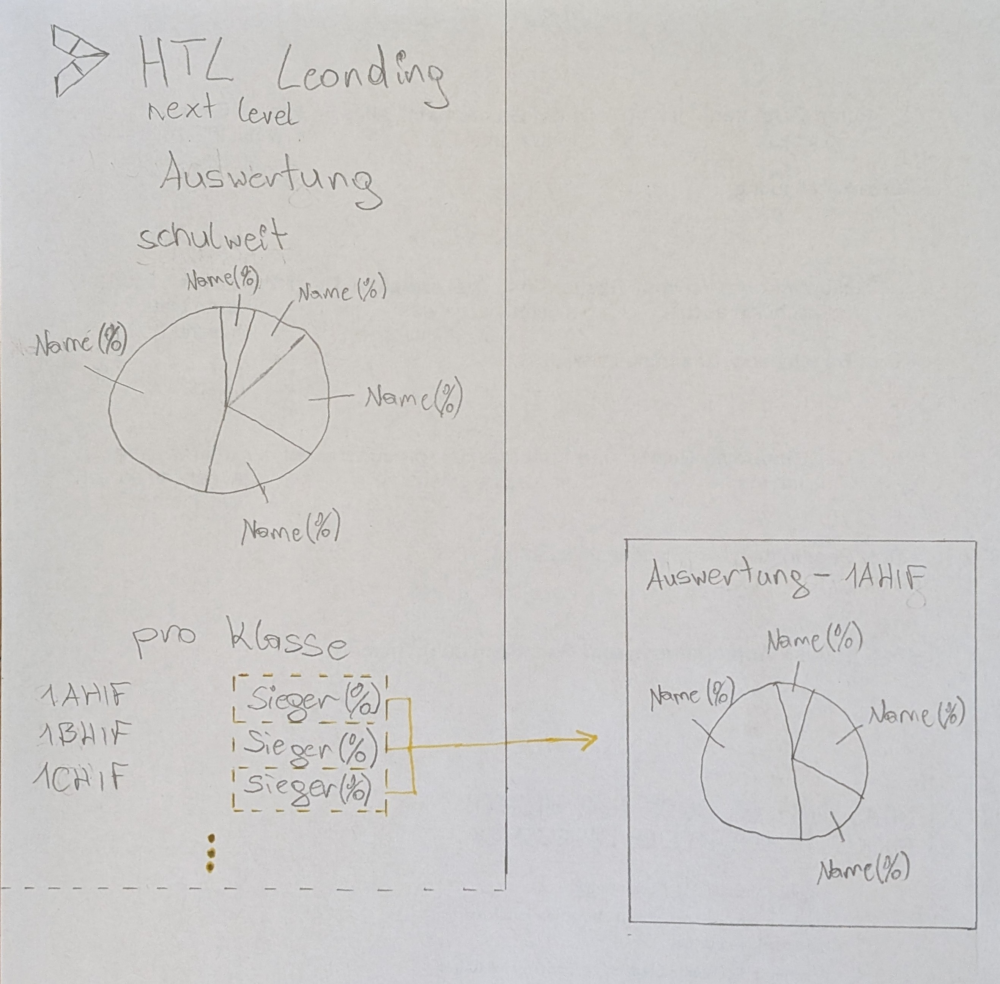

= Wireframes

== Lehrer bzw. Schüler Auswahl (Elysee Mbala)

// image

== Anmeldung (Sarah Ngimbi)

// image

== Stimmenabgabe (Flora Dallinger)

// image
image::images/stimmen_abgabe.png[]

== Auswertung (Antonio Subašić)

